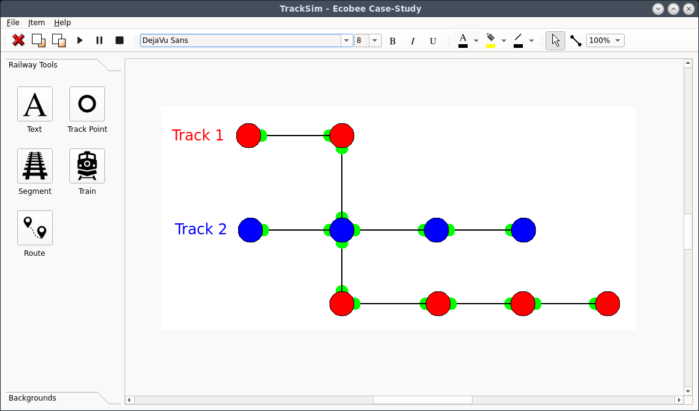

# Railway Traffic Simulator
This is a C++ Application based on Qt6. Native C++ code implements the Railway Editor and has an embedded python interpreter to provide a powerful/flexible simulation 

# Videos

  

<iframe class="rumble" width="640" height="360" src="https://rumble.com/embed/v58ist1/?pub=h6wnt" frameborder="0" allowfullscreen></iframe>

  

# Building for Linux
- Instsall Qt6
- Copy CMakeLists-Linux-PythonXXX.txt to CMakeLists.txt where XXX matches the version of the installed python3
- Have Python3-dev package installed;
  - for Debian/Ubuntu/Mint:
    sudo apt install python3-dev
- Launch the QtCreator and Open the CMakeLists.txt file
- Build the App using Qt Creator for the first time
- Run the following command once: "cmake -G Ninja ./build/Desktop_Qt_6_7_2-Debug"
- Subsequent builds can be done by just running ./mk command line
# Run
To run just use either ./run or ./run-dark commands

